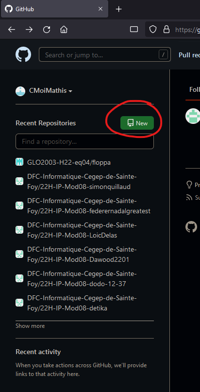

# Procédure création dépot github d’équipe

# Création initiale du dépot

1. Allez sur [github.com](http://github.com) et cliquez sur le bouton de création de dépot.
    
    
    
2. Donnez un nom à votre dépot. Il est recommandé de suivre une nomenclature pour pouvoir mieux se retrouver parmi les différents dépots de votre compte. Celle proposée dans l’exemple est “nomDeCour-nomDuDevoir”.

Il est aussi important de mettre la visibilité à privée.

Vous pouvez aussi sélectionner un .*gitignore* préfait. Cela va vous permettre d’éviter d’effectuer cette étape plus tard. Dans la capture d’écran ci dessous, je crée un dépot pour un projet laravel. Donc, je sélectionne le *.gitignore* de laravel.

    
3. Après avoir cliqué le bouton de création, votre dépot est crée!
    

    
4. Vous pouvez maitenant cloner ce projet sur votre poste pour débuter à ajouter le code de départ. Il existe plusieurs façons de cloner le projet selon le client git que vous utilisez. Dans cet exemple, nous allons utiliser l’intégration git de visual studio code.

Ouvrez donc visual studio code et naviguez dans la section git, cliquez sur “cloner un dépot” et cliquez sur “cloner depuis GitHub” comme dans l’image ci dessous.

**Attention : Si l’option de cloner un dépot ne s’affiche pas, vous devez fermer le dossier ouvert dans Visual Studio Code à l’aide du menu “fichier” en haut à gauche et “fermer le dossier”.**
    

    
5. L’autorisation de se connecter devrais apparaitre dans votre navigateur. Acceptez-la et authorisez la page web à ouvrir Visual Studio Code.
    

    
6. Maitenant que vous êtes connecté, si vous refaites l’étape 4, vous devrez voir une liste de vous dépots GitHub lorsque vous cliquz sur “Cloner avec GitHub”.

Sélectionnez le dépôt crée précedament et clonez le à un endroit que vous pouvez facilement retrouver. (Ex: C:\Git).
    
    
    
7. Finalement, cliquez sur la notification pour ouvrir votre dépot ou allez dans le menu déroulant “fichier” et “ouvrir un dossier”.

ou 

# Ajouter des collaborateurs

Pour travailler en équipe sur un dépot, il faut explicitement les ajouter comme membres d’équipe au dépot.

Pour ce faire, allez à la page de votre dépot GitHub et selectionnez la section paramètres. 

Puis allez dans la section collaborateurs.

Vous pouvez maitenant ajouter vous coéquipiers pour leur donner accès au dépot.

